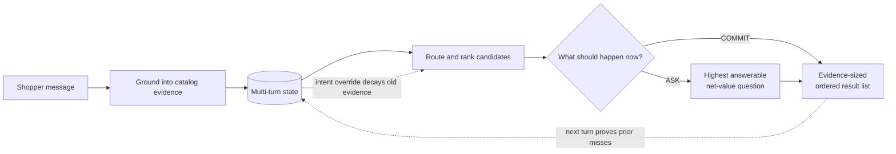

# 🛍️ ARC — Ask · Rank · Commit

### An answerability-aware, evidence-grounded sequential decision agent for conversational shopping

ARC is an offline multi-turn shopping agent built for TikTok TechJam 2026
Track 4.

One hidden product. A 50,000-item catalog. At most ten turns. The shopper starts
with incomplete requirements and may decline a question or change their mind.

ARC treats this as a **sequential decision problem**, not a one-shot
search query. On every turn it makes three connected decisions:

- 💬 **ASK** the question that is answerable and worth its extra turn;
- 📊 **RANK** products using accumulated shopper evidence, not popularity alone;
- 🎯 **COMMIT** only as many results as the current evidence can safely support.

| System                    |        Hit Rate@10 |                MRR |            MTTC |     TechnicalScore |
| ------------------------- | -----------------: | -----------------: | --------------: | -----------------: |
| Organizer weak baseline   |           0.125000 |           0.068034 |           9.810 |           0.106710 |
| ARC before this optimization | 1.000000 | 0.993333 | 2.040 | 0.977200 |
| **ARC** | **1.000000** | **1.000000** | **1.980** | **0.980400** |

These results use the unchanged organizer evaluator over all 200 public
sessions. ARC uses **zero model tokens, zero network calls, no GPU, and only the
Python standard library**. The measured optimization comparison is recorded in
[`results/optimization_results.json`](results/optimization_results.json).

## 🕹️ Try it live

**<https://kelvin715.github.io/techjam-2026-shopping-copilot/>**

The hosted replay and local Agent expose the same inspectable ARC decision
pipeline.

Ten pages in the browser. No install, no catalog download, no API key. Pages
1–3 give the problem, the turn loop, and the organizer result; pages 4–7 replay
all four turns of one session; page 8 is the evaluation evidence; page 9 is
what happens when the shopper stops quoting the catalog. Arrow keys
change pages, space plays, `F` is fullscreen. The green `VERIFIED REPLAY` badge
is earned: the page is published only when a SHA-256 manifest of every recorded
source still matches the repository.

### 🔎 Inspect any of the 200 sessions yourself

**[→ Open the session explorer](https://kelvin715.github.io/techjam-2026-shopping-copilot/?scene=9)**

[](https://kelvin715.github.io/techjam-2026-shopping-copilot/?scene=9&session=public_0187&turn=4)

<sub>Turn 4 of `public_0187`. Click the image to open that exact state.</sub>

Every public session was replayed through the submitted Agent and the unchanged
evaluator, and the last page lets you walk any of them:

- pick a **Scenario** — buying, browsing, intent override, boundary — or leave
  it on all 200;
- choose a **Session** id, or press **Random** to sample one;
- step the **Turn** selector: each step shows only the messages ARC had seen by
  that point, the list it submitted, and the decision certificate behind it —
  action, clues held, candidates ruled out, and the score margin;
- the target product and its rank sit in a panel labelled evaluator-only. It is
  joined *after* `Agent.respond` returns and is never sent to the Agent.

One click lands on a specific case:

- [`public_0187` at turn 3](https://kelvin715.github.io/techjam-2026-shopping-copilot/?scene=9&session=public_0187&turn=3) — the boundary case where the shopper declines a question and the policy pivots
- [only the intent-override sessions](https://kelvin715.github.io/techjam-2026-shopping-copilot/?scene=9&scenario=intent_override)
- [the four-turn walkthrough that explains the loop](https://kelvin715.github.io/techjam-2026-shopping-copilot/?scene=3)

The second tab, **Live Agent**, replaces the recording with the real thing: type
any shopper message and the submitted `Agent.respond` answers it, then *Explain
this decision* prints the certificate and the smallest clue removal that would
change rank one. It needs the 50,000-product catalog, which the data terms keep
out of this repository, so it runs locally only:

```bash
python3 demo/server.py --catalog data/catalog.jsonl --live --prewarm
```

## 🧭 Why shopping needs more than retrieval

A retrieval system can contain the right product and still create a poor
shopping experience:

1. A vague request may leave hundreds of equally plausible products.
2. A high-discrimination question may be useless if the shopper cannot answer it.
3. Showing ten weak candidates too early can end the session with the target at
   a poor rank.
4. Repeating products that were already rejected wastes both turns and trust.
5. A changed preference can make otherwise correct conversation memory stale.

The challenge metric makes these failures concrete. Hit Rate rewards finding
the target, MRR rewards putting it near the top, and MTTC charges for every
additional turn. ARC therefore optimizes the **interaction loop**,
not only a retrieval score.



## 🔁 The three decisions

### 💬 ASK — spend a turn only when it has value

For every allowed question, the agent treats plausible candidates as
counterfactual targets, predicts the answer exposed by each product's catalog
signature, and estimates the resulting rank utility:

```text
MVOI(question) = 0.50 × expected Hit@10
               + 0.30 × expected MRR
               - current rank utility
               - 0.02 × one additional turn
```

The `<none>` branch is handled honestly: “I have no preference” exhausts a
question but does not invent a new ranking constraint. The agent therefore asks
what is **answerable and likely to improve the scored outcome**, rather than
what merely partitions the candidate set most evenly.

### 📊 RANK — keep explicit evidence ahead of popularity

The agent first routes the conversation to a catalog shelf, then combines four
local signals:

```text
core(product) = normalized rare-term evidence
                + 0.30 × typed constraint satisfaction
                + 0.90 × canonical signature likelihood
```

The canonical four-slot signature distinguishes near-duplicate products whose
words occur in different fields or positions. Material, color, and budget are
checked as typed constraints. Review count and rating may break a near-tie, but
only when a candidate's core evidence is within `0.15` of the best candidate;
popularity cannot override a clear shopper requirement.

### 🎯 COMMIT — control output risk, not just relevance

With incomplete evidence, the agent returns one safe candidate while continuing
to clarify. Once all visible constraints are known, the shopper has exhausted
their preferences, or the conversation reaches the calibrated late-turn gate,
it expands to the full Top 10.

The protocol also provides grounded negative feedback: if the evaluator calls
the agent again, every product in the previous submitted list is a **proven
miss** for the active intent. Those products are excluded on the next turn.
When the shopper overrides their intent, this history is cleared atomically and
the old preference is retained only at reduced confidence.

## 🧩 Where a language model earns its place

The challenge permits LLMs but does not require one, and the scored path of
ARC does not use one: on the organizer's protocol the dominant uncertainty is
*which useful constraint has not been revealed yet*, not how to read the
sentence. Every top public-set score in this track, ours included, comes from
a deterministic system, and the two submissions we found that put a model
inside the scoring loop lost score to it.

That protocol, however, has the shopper **quote catalog strings inside fixed
templates**. Real shoppers do not. So ARC ships an optional **language
layer** that is off by default and byte-for-byte irrelevant to the official
score, but turns on for free-form wording. It is a cascade: the catalog reads
the sentence first, and the model is consulted only when that is not enough.

```text
message ──► matches a protocol template? ──yes──► deterministic parser (0 tokens)
                     │
                     no ──► the catalog reads the sentence (0 tokens)
                            verbatim catalog strings · material · colour · "$n" bounds
                            "don't care" / "not those" / "forget the ..." dialogue acts
                                     │
                     found a catalog feature, or a plain dialogue act? ──yes──► the same RANK · ASK · COMMIT
                                     │
                                     no (nothing read, or a cancellation)
                                     │
                            LLM proposes ──► catalog disposes ──► the same RANK · ASK · COMMIT
                            {intent, category,      every proposal needs evidence among the
                             material, color,        products still in play:
                             budget, features,        signature_verbatim 1.0 · signature_mapped 0.8
                             dropped}                 lexical 0.6 · lexical_tokens 0.5 · else refused
```

- **The catalog is the first reader, not the last check.** Our own attribution
  study below showed that exact catalog-string matching with no model was the
  best reader whenever shoppers kept the listing's words, and that the model
  paid for itself only under paraphrase. The cascade keeps both: a message the
  catalog can read costs zero tokens; the model is consulted when the sentence
  contains no catalog feature the catalog can find, or when the shopper cancels
  something and only a reader of the sentence can say *what*.
- **The model never ranks, never sees a label, and never sees the catalog
  beyond forty phrases.** It sees the shopper's sentence plus at most 40 of the
  most common catalog phrases in the candidate category, so it can say things
  in the catalog's own words before the catalog checks them. The check proves
  catalog support for a phrase, not that the shopper meant exactly that.
- **Protocol wording never reaches the model.** On the 200 public sessions the
  language layer makes zero calls and reports zero tokens; the score is identical.
- **A failed model call cannot strand the session.** Whatever the catalog
  stage read stays in place, a near-miss JSON reply (a dropped quote, a
  trailing comma) is repaired rather than discarded, and a reply that taught
  the reader nothing retires the question that was asked, exactly as the
  protocol's "no additional preference" would.
- **A shopper who builds on the slate keeps it.** The simulator continues a
  session only when every shown product missed, so the controller treats
  continuation as refutation. "The first one looks good, does it come in
  blue?" is the opposite, and the language layer keeps that slate eligible;
  "not those" still refutes it.
- **A category becomes a union of shelves**, not a bet on one; once a full
  slate has been refuted the session looks beyond the pool through a
  rarity-weighted inverted index bounded to 2,000 products (failure detection
  and strategy switching without a 50,000-product rescan on every later turn).
- **An explicit price ceiling or floor is a hard filter on the grounded
  pool** ("under $60" removes products priced above it, keeps unpriced ones
  flagged as unknown, and relaxes itself if nothing survives); the protocol's
  `budget around $n` keeps its proximity score.
- **A cancelled preference is decayed to `0.5` confidence**, exactly as the
  deterministic override policy does, and the certificate records what was
  accepted, mapped, refused and why. A dead or slow endpoint degrades to the
  deterministic path with a contract-valid response.

Enable it with environment variables at construction time:

```bash
ARC_LLM_MODE=ground   ARC_LLM_BASE_URL=http://host:port/v1   ARC_LLM_MODEL=gemma4   # grounding only
ARC_LLM_MODE=assist   # grounding + the customer-facing message phrased from the certificate
```

### 🗣️ What happens when the shopper stops quoting the catalog

`tools/human_language_benchmark.py` keeps the organizer's simulator policy
byte-identical and rewrites only the *surface form* of every customer message
with a language model acting as a human shopper: **natural** keeps every
attribute phrase verbatim inside casual wording; **paraphrase** also says every
attribute in the shopper's own words and never quotes the listing. Those names
describe the prompt, not guaranteed properties of the output: an audit over all
1,437 reachable simulator messages (`paper/audit_rewrites.py`) finds every catalog
clue kept as a literal substring in 88% of the gemma4 verbatim rewrites but only
29% of the qwen2.5 ones, and 5–8% under the paraphrase prompts, which also drop
numbers (budgets, sizes) from many messages. The same rewrites are served to
every arm from a cache.

| Shopper wording | Arm | Hit@10 | MRR | MTTC | TechnicalScore | Model calls | Tokens |
|---|---|---:|---:|---:|---:|---:|---:|
| Organizer templates (control) | deterministic (frozen submission) | 1.0000 | 1.0000 | 1.980 | 0.980400 | 0 | 0 |
| Organizer templates (control) | catalog reads the sentence, no model | 1.0000 | 1.0000 | 1.980 | 0.980400 | 0 | 0 |
| Organizer templates (control) | cascade: catalog first, model on demand (shipped) | 1.0000 | 1.0000 | 1.980 | 0.980400 | 0 | 0 |
| Organizer templates (control) | model on every off-protocol message | 1.0000 | 1.0000 | 1.980 | 0.980400 | 0 | 0 |
| Natural wording, attributes verbatim (gemma4 shopper) | deterministic (frozen submission) | 0.8400 | 0.6400 | 4.335 | 0.745312 | 0 | 0 |
| Natural wording, attributes verbatim (gemma4 shopper) | catalog reads the sentence, no model | 1.0000 | 0.9829 | 2.195 | 0.970975 | 0 | 0 |
| Natural wording, attributes verbatim (gemma4 shopper) | cascade: catalog first, model on demand (shipped) | 1.0000 | 0.9829 | 2.155 | **0.971775** | 117 | 132,369 |
| Natural wording, attributes verbatim (gemma4 shopper) | model on every off-protocol message | 0.9900 | 0.9607 | 2.370 | 0.955802 | 216 | 242,919 |
| Natural wording, attributes paraphrased (gemma4 shopper) | deterministic (frozen submission) | 0.2150 | 0.0681 | 10.005 | 0.147826 | 0 | 0 |
| Natural wording, attributes paraphrased (gemma4 shopper) | catalog reads the sentence, no model | 0.7050 | 0.5518 | 4.970 | 0.638647 | 0 | 0 |
| Natural wording, attributes paraphrased (gemma4 shopper) | cascade: catalog first, model on demand (shipped) | 0.8500 | 0.7267 | 4.060 | **0.781795** | 766 | 809,633 |
| Natural wording, attributes paraphrased (gemma4 shopper) | model on every off-protocol message | 0.8550 | 0.7471 | 3.970 | 0.792233 | 764 | 801,763 |
| Natural wording, attributes verbatim (qwen2.5-7b-instruct shopper) | deterministic (frozen submission) | 0.5650 | 0.3889 | 6.770 | 0.483770 | 0 | 0 |
| Natural wording, attributes verbatim (qwen2.5-7b-instruct shopper) | catalog reads the sentence, no model | 0.9250 | 0.8597 | 2.810 | 0.884195 | 0 | 0 |
| Natural wording, attributes verbatim (qwen2.5-7b-instruct shopper) | cascade: catalog first, model on demand (shipped) | 0.9400 | 0.8946 | 2.715 | **0.904066** | 309 | 319,242 |
| Natural wording, attributes verbatim (qwen2.5-7b-instruct shopper) | model on every off-protocol message | 0.9100 | 0.8376 | 3.115 | 0.863977 | 494 | 509,768 |
| Natural wording, attributes paraphrased (qwen2.5-7b-instruct shopper) | deterministic (frozen submission) | 0.3200 | 0.1778 | 8.980 | 0.253752 | 0 | 0 |
| Natural wording, attributes paraphrased (qwen2.5-7b-instruct shopper) | catalog reads the sentence, no model | 0.7650 | 0.6481 | 4.230 | 0.712320 | 0 | 0 |
| Natural wording, attributes paraphrased (qwen2.5-7b-instruct shopper) | cascade: catalog first, model on demand (shipped) | 0.8050 | 0.6942 | 4.085 | **0.749050** | 532 | 557,331 |
| Natural wording, attributes paraphrased (qwen2.5-7b-instruct shopper) | model on every off-protocol message | 0.8100 | 0.7017 | 4.000 | 0.755511 | 673 | 703,343 |

- 200 public sessions per cell; customer rewrites by `gemma4`, grounding by `gemma4` (the same local vLLM service; the rewriter sees only the template message, never the catalog).
- Every rewrite and every model reply is served from an immutable cache and the grid was replayed with `--strict-replay --strict-grounding` (zero cache misses); per-session outcomes and turn-level trajectories are in `results/attribution/replay_v2/strict/`, and `tools/check_attribution_replay.py` verifies that the replay reproduces every cell.
- On the organizer templates every arm makes zero model calls and reproduces the deterministic score exactly: protocol wording never reaches the model.
- Natural wording, attributes verbatim: the shipped cascade averages 0.58 model calls and 662 tokens per session (the model-on-every-message baseline: 1.08 calls, 1,215 tokens), 456 ms per model call (latency from a live-call run of the same condition).
- Natural wording, attributes paraphrased: the shipped cascade averages 3.83 model calls and 4,048 tokens per session (the model-on-every-message baseline: 3.82 calls, 4,009 tokens), 366 ms per model call (latency from a live-call run of the same condition).
- Example rewrite: simulator “I'm looking for Jewelry Necklaces. A key requirement is: Material:alloy.” → shopper “I'm looking for some alloy necklaces.”.
- Agent latency with the language layer on, model calls included: natural wording mean 0.13 s per turn (p95 0.51 s); paraphrased wording mean 0.32 s (p95 0.58 s). A session that has refuted a full slate looks beyond its shelf pool through a rarity-weighted inverted index bounded to 2,000 products instead of re-scoring the whole catalog on every later turn.
- Paraphrased wording by scenario (cascade): buying 0.887 / browsing 0.912 / intent override 0.767 / boundary 0.300 Hit@10. The boundary drop is a simulator artefact: its shopper says "no preference" once and then answers that very attribute later, which a human reading treats as a retired question.
- Cross-model check: with `qwen2.5-7b-instruct` playing the shopper (rewrites pre-generated by `tools/precompute_customer_rewrites.py`, grounding still `gemma4`), natural wording scores 0.4838 deterministic and 0.9041 cascade (Hit@10 0.565 → 0.940, 1.5 calls per session); paraphrased wording scores 0.2538 deterministic and 0.7490 cascade: the same direction as the same-model run.
- These are research diagnostics with a model playing the shopper, not organizer scores.

#### Where the recovery comes from

Nine agents on the same cached rewrites, all sharing the ARC controller and differing only in how an unrecognised message enters the constraint state (`tools/run_attribution.py`; paired scenario-stratified bootstrap intervals in `results/attribution/intervals.md`). Bold marks the best score in each rewritten condition.

| Arm | Templates | Verbatim (G) | Paraphrase (G) | Verbatim (Q) | Paraphrase (Q) | Calls/session |
|---|---:|---:|---:|---:|---:|---:|
| frozen controller (template parser only) | 0.9804 | 0.7453 | 0.1478 | 0.4838 | 0.2538 | 0.0 |
| exact catalog-string matching, no model | 0.9804 | **0.9695** | 0.6386 | **0.8842** | 0.7150 | 0.0 |
| sentence-embedding similarity (bge-small), no model calls | 0.9804 | 0.8489 | 0.7273 | 0.7865 | 0.6924 | 0.0 |
| LLM proposes, everything admitted | 0.9804 | 0.9606 | 0.7856 | 0.8741 | **0.7802** | 1.1–3.9 |
| LLM proposes, catalog filters, flat weights | 0.9804 | 0.9568 | 0.7833 | 0.8781 | 0.7655 | 1.1–4.0 |
| LLM proposes, exact signature strings only | 0.9804 | 0.9423 | 0.7228 | 0.8232 | 0.7168 | 1.1–4.2 |
| LLM proposes, catalog verifies, no vocabulary hints | 0.9804 | 0.9622 | 0.7103 | 0.8672 | 0.7578 | 1.1–4.4 |
| LLM proposes, catalog verifies (model on every off-protocol message) | 0.9804 | 0.9558 | **0.7921** | 0.8634 | 0.7594 | 1.1–3.8 |
| LLM as agent: asks and ranks a 40-item shortlist | 0.6923 | 0.6846 | 0.5440 | 0.6440 | 0.5139 | 3.9–5.8 |
| **Cascade: catalog reads first, model on demand (shipped)** | 0.9804 | **0.9718** | 0.7818 | **0.9041** | 0.7490 | 0.6–3.8 |

- **Template independence explains most of the loss.** Exact catalog-string matching without any model recovers the largest share in every condition and has the highest score of the original nine arms when the rewrites keep the attribute strings. The frozen parser fails on those messages because it is bound to the organizer's templates, not because they need interpretation.
- **The cascade keeps the best of both readers.** Built after this study, it lets the catalog read the sentence first and consults the model only when attribute vocabulary is left unread or the shopper cancels something. Against the model-on-every-message reader it is better by +0.016 [+0.004, +0.033] (G) and +0.040 [+0.016, +0.067] (Q) when the attribute strings are kept, at 0.6 and 1.5 calls per session instead of 1.1 and 2.5, and indistinguishable under paraphrase (-0.010 [-0.041, +0.020] G, -0.007 [-0.036, +0.023] Q) at equal or fewer calls (paired, scenario-stratified bootstrap in `results/attribution/replay_v2/strict/intervals.md`). The cascade row comes from the grid rerun in `results/attribution/replay_v2/strict/` (the model-only reader re-measured there at 0.9558 / 0.7922 / 0.8640 / 0.7555 after the JSON repair); the other rows are the original replay.
- **The model adds under paraphrase only.** Grounding minus exact matching is +0.153 [+0.095, +0.212] under Paraphrase (G) and +0.044 [-0.002, +0.091] under Paraphrase (Q); under the verbatim conditions it is -0.014 [-0.031, -0.000] (G) and -0.021 [-0.052, +0.008] (Q).
- **Catalog verification is rarely exercised.** With vocabulary hints in the prompt the model proposes catalog strings, so the check rejects only 1–9 feature proposals per run; admitting everything scores the same or better (-0.005 [-0.016, +0.003] G verbatim, -0.021 [-0.043, -0.001] Q paraphrase, grounding minus unverified). Only the exact-only restriction hurts, in every condition. This is a negative result for our own design; it holds for a simulator whose clues are catalog strings.
- **An LLM that asks and ranks on its own is the weakest arm everywhere**, including on the organizer templates, at 4–6 calls and 10–16k tokens per session.

#### Dense retrieval, tried two ways after the study

The sentence-embedding row above adds a cosine term to every candidate's score. Two more
disciplined uses were built and measured on the same cached rewrites (`src/dense.py`,
off by default; `results/attribution/dense/summary.md`): **as a translator**, expanding
each admitted feature into the catalog strings within cosine 0.80 of it, credited at half
weight, and mapping an unverifiable phrase to its nearest supported catalog value; and
**as a recall channel**, unioning the shelves whose names embed near the category phrase
into the pool and the 500 nearest products into the post-refutation widening.

| Wording | cascade | + translator | + recall | + both |
|---|---:|---:|---:|---:|
| Verbatim (G) | 0.9718 | 0.9710 | 0.9718 | 0.9708 |
| Paraphrase (G) | 0.7818 | 0.7771 | 0.7639 | 0.7762 |
| Verbatim (Q) | 0.9041 | 0.9038 | 0.9017 | 0.9022 |
| Paraphrase (Q) | 0.7490 | 0.7381 | 0.7341 | 0.7421 |

No cell is significantly positive (paired intervals in `results/attribution/dense/intervals.md`);
the organizer templates still score 0.980400 with zero calls. The translator fixes six paraphrase
misses (`waterproof → water resistant`, `slip on closure → pull on closure`) and breaks seven
(`100% cotton → 100% polyester`, `rubber sole → fabric sole`, `hand wash → machine wash`): a
general-purpose embedding places a paraphrase and an attribute-changing sibling at the same
distance (`waterproof ~ water resistant` 0.839, `rubber sole ~ leather sole` 0.841), so no
threshold separates them. The recall channel rescues four category mappings (`women's denim →
Women Jeans`) and loses seven sessions to decoys in the wider pool. This is the negative result
behind keeping every admitted piece of evidence a catalog string.

## 🆕 Since the preliminary submission

The scored path is frozen: the same `0.980400`, the same zero tokens, and an
evaluator run that reproduces every one of the 200 public sessions
byte-for-byte after the changes below. Everything new is on the free-form
language path and in the engineering around it.

| Change | Why | Measured effect |
| --- | --- | --- |
| **Cascade reader**: the catalog reads the sentence first; the model is consulted only when no catalog feature can be found in it or the shopper cancels something | Our attribution study showed exact catalog matching beat the model whenever shoppers kept the listing's words | Best score in every rewritten condition (table below), with 2–4× fewer model calls than calling the model on every message |
| **Near-miss JSON repair** | 13% of paraphrased turns were lost to one dropped quote in the model's reply | Zero unparseable turns; a failed reply no longer loops the same question |
| **Bounded widening** through a rarity-weighted inverted index (2,000 products) instead of a 50,000-product rescan | Tail latency after a refuted slate | Agent-side p95 per turn on paraphrased wording from 7.5 s to 0.14 s (cached-model replay, so model time excluded); scores unchanged |
| **Per-phrase memoisation in the ranker** | 700,000 redundant string parses per full-catalog scoring pass | Full-catalog scoring 3.8 s to 1.1 s, mean evaluator time per response 38.7 ms to 15.0 ms; public-set outputs identical |
| **Positive follow-ups keep the slate** ("the first one looks good, in blue?") | Continuation means refutation only for the simulator | Demo behaviour; no benchmark effect |
| **Cross-category diagnostic** on Electronics, Musical Instruments and Baby Products catalogs built from Amazon Reviews 2023 | Every constant was chosen on the clothing catalog | 0.978 / 0.978 / 0.973 under the identical protocol, clothing reference 0.959; no constant changed |

## 🗺️ How this maps to the Track 4 directions

The organizer's suggested techniques are possible tools, not a checklist. Our
design uses the parts that improve the shopping decision and leaves speculative
complexity disabled.

| Track direction                          | ARC implementation                                                         | Shopper-facing outcome                                                 |
| ---------------------------------------- | -------------------------------------------------------------------------- | ---------------------------------------------------------------------- |
| Buying vs. Browsing routing              | Scenario-aware shelf and question routing                                  | Decisive buyers are served immediately; vague browsers are clarified   |
| Hybrid retrieval and reranking           | Shelf retrieval plus lexical, typed, signature, and bounded-prior evidence | Exact constraints beat generic popularity                              |
| Structured state and intent override     | Confidence-weighted multi-turn memory with atomic history reset            | Preferences accumulate without trapping the shopper in an old intent   |
| Adaptive clarification                   | Answerability-aware metric value of information                            | The agent avoids questions that cost a turn but add no usable evidence |
| Failure detection and strategy switching | Proven-miss exclusion, refusal-aware pivot, late exact-tie rotation        | Rejected products are not repeated and long-tail ties can recover      |
| Cold-start ranking                       | Review-count prior only before the first shopper constraint                | A vague first turn is useful without letting popularity override intent |
| Indistinguishable-candidate planning      | Finite-horizon batch-size optimization with final-turn Hit@10 insurance     | Exact intent twins are tested at rank one instead of committed at a weak rank |
| Low latency and token cost               | Deterministic, offline, standard-library runtime                           | No API outage, credential, GPU, or per-query model cost                |
| Transparent explanations                 | Evidence certificates and verified minimal counterfactuals                 | Engineers can inspect why the action and rank changed                  |
| LLM semantic understanding               | Optional catalog-verified grounding layer for free-form wording (off on the scored path) | Shoppers can speak naturally; the model cannot invent evidence |
| Safe personalization                     | Aggregate profile support exists, but its ranking weight is disabled       | Unproven profile correlations cannot override explicit intent          |

Dense semantic retrieval and profile weighting remain optional extensions. They
were not enabled simply to match a suggested architecture; a new component must
earn its complexity across public, popularity-matched, and uniform long-tail
diagnostics.

## 📈 Evaluation

### 🏁 Official public set

| Scenario          |             n |        Hit Rate@10 |                MRR |               MTTC |
| ----------------- | ------------: | -----------------: | -----------------: | -----------------: |
| Buying            |            80 |           1.000000 |           1.000000 |           1.487500 |
| Browsing          |            80 |           1.000000 |           1.000000 |           1.775000 |
| Intent override   |            30 |           1.000000 |           1.000000 |           3.666667 |
| Boundary          |            10 |           1.000000 |           1.000000 |           2.500000 |
| **Overall** | **200** | **1.000000** | **1.000000** | **1.980000** |

The unchanged evaluator reports ARC's final TechnicalScore of `0.980400`.

The organizer weak baseline needs `9.81` turns on average; ARC needs `1.980`, a
reduction of `7.830` evaluator turns while raising MRR from `0.068034` to `1.0`.

With Hit Rate@10 and MRR both saturated at `1.0`, TechnicalScore is a pure
function of MTTC, and a rank-1 result demoted to rank 2 costs as much as `7.5`
saved turns. `tools/turn_audit.py` replays the organizer loop while capturing
the full ranked list each turn and reports that **zero** turns are lost to the
output gate: the target is exposed on exactly the turn it first reaches rank 1.
The residual MTTC is therefore bounded by disclosure, not by the policy —
`intent_override` cannot score before its override turn (floor `3.600`),
`boundary` spends one turn on the "no preference" reply, and 90 of 200 sessions
open with no constraint at all.

### 🔬 Target-disjoint diagnostics

| Diagnostic         |     n | Hit Rate@10 |      MRR |    MTTC | TechnicalScore |
| ------------------ | ----: | ----------: | -------: | ------: | -------------: |
| Popularity-matched |   800 |    1.000000 | 0.984496 | 2.12125 |       0.972924 |
| Uniform long-tail  | 1,000 |    0.996000 | 0.977408 | 2.61900 |       0.958842 |

These are deterministic synthetic sessions over non-public catalog targets.
They test whether the design survives outside the 200 public labels; they are
not organizer-private scores or claims about the private distribution.

### 🧳 Catalogs the design never saw

Every tunable was chosen on the organizer's clothing catalog. The organizer's
catalog is a sample of one category of Amazon Reviews 2023, and the other
categories share its fields, so the same simulator, the same unchanged
evaluator and the same Agent can run on a 50,000-product catalog from a
different department (`tools/build_category_catalog.py`, fixed seed,
`tools/cross_category.py`; 1,000 uniform targets each, public-set profiles).

| Catalog | Products | Shelves | Priced | Hit@10 | MRR | MTTC | TechnicalScore |
|---|---:|---:|---:|---:|---:|---:|---:|
| Clothing, Shoes & Jewelry (organizer, reference) | 50,000 | 1,115 | 21% | 0.9960 | 0.9774 | 2.602 | 0.959167 |
| Electronics | 50,000 | 876 | 42% | 1.0000 | 0.9953 | 2.028 | 0.978040 |
| Musical Instruments | 50,000 | 654 | 45% | 1.0000 | 0.9982 | 2.061 | 0.978240 |
| Baby Products | 50,000 | 405 | 34% | 1.0000 | 0.9949 | 2.293 | 0.972608 |

No constant was changed between rows. The three unseen catalogs contain only
products with non-empty features and details (the organizer's catalog keeps
13% sparser products) and price more of their products, which is part of why
they score above the reference; the point is the absence of a drop. A
different category is still the same simulator: this measures whether the
design was tuned to clothing, not whether it survives a different interaction
protocol. Summary in [`results/cross_category/summary.json`](results/cross_category/summary.json);
the derived catalogs stay local under the source dataset's terms.

### 🛡️ Language and policy robustness

| Robustness condition | Hit@10 |    MRR | TechnicalScore |
| -------------------- | -----: | -----: | -------------: |
| Natural paraphrase   |  1.000 | 1.0000 |       0.980600 |
| One hidden clue      |  1.000 | 0.9079 |       0.951775 |

Across 100 public targets, all audited traces stay within ten turns, return
valid unique catalog ASINs, do not repeat proven misses before an override,
report zero tokens, and leave the catalog byte-identical.

### ⚡ Runtime disclosure

| Resource                               | Measurement |
| -------------------------------------- | ----------: |
| Agent startup/index build              |     10.80 s |
| Mean evaluator wall time per response  |    14.99 ms |
| Evaluation wall time after startup     |      5.94 s |
| Peak evaluator + agent resident memory |  469,516 KB |
| Prompt / completion tokens             |       0 / 0 |
| External API calls                     |           0 |
| Estimated inference cost               |       $0.00 |
| Network / GPU required for scoring     |     No / No |

Timing varies with CPU and filesystem cache. The development evaluator retains
a second catalog representation; a production integration could share immutable
storage.

## 🏗️ Architecture and source map

| Runtime responsibility                         | Source                                  |
| ---------------------------------------------- | --------------------------------------- |
| Official`Agent.reset/respond` interface      | [`agent.py`](agent.py)                 |
| Shelf, catalog, signature, and support indexes | [`src/shelf.py`](src/shelf.py)         |
| Intent parsing and multi-turn state            | [`src/dialog.py`](src/dialog.py)       |
| Hybrid evidence ranking and bounded prior      | [`src/rank.py`](src/rank.py)           |
| Clarification and patient output policy        | [`src/policy.py`](src/policy.py)       |
| MVOI and decision certificates                 | [`src/evidence.py`](src/evidence.py)   |
| Frozen measured configuration                  | [`src/config.py`](src/config.py)       |
| Evaluator compatibility shim                   | [`starter/agent.py`](starter/agent.py) |

At startup, the agent constructs read-only shelf, document-frequency,
normalized-text, typed-attribute, canonical-signature, rating, and rating-count
indexes. At runtime, each session stores the shelf, scenario, normalized unique
constraints, confidence, clue-order reliability, exhausted questions, and
recommendation history. No catalog row is modified or mocked.

The root entry point implements the organizer contract directly:

```python
class Agent:
    def reset(self, session_id: str, user_profile: dict) -> None: ...

    def respond(
        self, session_id: str, user_message: str, turn: int, top_k: int
    ) -> dict: ...
```

## 🔧 Setup and reproduction

Requirements:

- Python 3.10 or newer;
- about 500 MB free RAM for the agent, or about 850 MB when the evaluator and
  agent both retain catalog representations;
- no GPU, API key, credential, vector database, or network at inference time.

There are no third-party runtime dependencies:

```bash
python3 -m pip install -r requirements.txt
```

Download `catalog.jsonl.gz` from the official
[participant-kit release](https://github.com/TechJam2026/techjam-conversational-search/releases/tag/participant-kit),
then verify and extract it:

```bash
sha256sum -c SHA256SUMS
gzip -dc catalog.jsonl.gz > data/catalog.jsonl
wc -l data/catalog.jsonl  # expected: 50000
```

Run contract checks and all 82 dependency-free tests:

```bash
python3 tools/preflight.py
python3 -m unittest discover -s tests -v
```

Run the unchanged public evaluator:

```bash
python3 -m evaluator.local_evaluator \
  --catalog data/catalog.jsonl \
  --dataset data/public_set.jsonl \
  --output results/public_full.json
```

Expected result:

```text
Hit Rate@10  1.000000
MRR          1.000000
MTTC         1.980000
Efficiency   0.902000
Score        0.980400
```

Reproduce the non-public-target and robustness diagnostics:

```bash
python3 tools/matched_proxy.py
python3 tools/uniform_proxy.py
python3 tools/robustness_policy_benchmark.py --count 100
python3 tools/turn_audit.py    # where every evaluator turn is spent
# catalogs from other Amazon Reviews 2023 categories (streams from Hugging Face)
python3 tools/build_category_catalog.py --category Electronics
python3 tools/cross_category.py --catalogs clothing=data/catalog.jsonl \
  electronics=data/catalog_electronics.jsonl
```

Machine-readable results are under [`results/`](results/). Each tool in
[`tools/`](tools/) prints its own usage and writes the summary it documents, so
the MVOI, output-risk calibration, and long-tail diagnostics can be re-run
directly.

## 📚 Where ARC sits

ARC's question policy is the *expected value of perfect information* of
[Rao & Daumé (ACL 2018)](https://aclanthology.org/P18-1255/) made specific to
the challenge metric and priced with the "no preference" branch; the patient
output gate matches the human-study finding that asking early and recommending
late improves both performance and satisfaction
([CIKM 2024](https://dl.acm.org/doi/10.1145/3627673.3679875)). Choosing a
computed policy over a trained one follows the decision-tree result that
interpretable rules beat reinforcement-learning conversational recommenders on
small data ([CIKM 2022](https://arxiv.org/abs/2208.14614)); proven-miss
exclusion is item-level negative feedback in the sense of
[Bi, Ai & Croft (2019)](https://arxiv.org/abs/1909.02071). Keeping the model
out of ranking and verifying its proposals against the catalog follows the
production pattern of LLM query rewriting checked by engine feedback
([Taobao, WWW 2024](https://arxiv.org/abs/2311.03758)) and the documented
failure modes of zero-shot LLM recommenders: hallucinated items, popularity
bias, and the repeated-item shortcut
([CIKM 2023](https://arxiv.org/abs/2308.10053)). The human-language benchmark
isolates the rewriting model from the catalog and target as recommended by the
analysis of LLM user simulators ([WWW 2024](https://arxiv.org/abs/2403.16416));
the next validation step is a human dialogue dataset such as
[PSCon (SIGIR 2025)](https://arxiv.org/abs/2502.13881). The full landscape,
including Rufus, Qwen×Taobao and Doubao×Douyin, is in
[`docs/RESEARCH_LANDSCAPE.md`](docs/RESEARCH_LANDSCAPE.md).

## ⚠️ Limitations

The conversations are simulated from product metadata. Private-set behavior
and real conversion or GMV impact remain unknown until controlled evaluation.

## 📋 Tools, data, and contribution disclosure

- **Runtime:** Python 3.10 standard library only; no API, framework, hosted
  model, vector database, or model token use.
- **Development:** Python, Git, command-line profiling, and Codex for
  repository navigation, test generation, and experiment orchestration.
- **Data:** frozen 50,000-product competition catalog and 200 public sessions
  derived from Amazon Reviews 2023 `Clothing_Shoes_and_Jewelry`; see
  [`DATA_ATTRIBUTION.md`](DATA_ATTRIBUTION.md).
- **Contribution:** see [Team and contributions](#team-and-contributions).

## 👥 Team and contributions

| Member                 | Contact               | Contribution                                                                                                                                                                                                           |
| ---------------------- | --------------------- | ---------------------------------------------------------------------------------------------------------------------------------------------------------------------------------------------------------------------- |
| **Zhihan Yang**  | zhihan.yang@u.nus.edu | Idea and implementation. Problem framing as a sequential decision loop, the ASK · RANK · COMMIT policy design, all submitted runtime code, the offline experiment and diagnostic tooling, and the judge-facing demo. |
| **Li Haixin**    | e1113229@u.nus.edu    | Evaluation and quality assurance. Test-suite and contract review, preflight checks, robustness and stress-case triage, and reproduction of the reported numbers from a clean checkout.                                 |
| **Dong Yicheng** | DONG0195@e.ntu.edu.sg | Demo video. Storyboard, recording, and editing of the walkthrough, and timing the narration against the presentation pages.                                                                                            |
| **Minxi Chen**   | chen1997@e.ntu.edu.sg | Documentation and submission materials. README and Devpost description review, judge Q&A, the business-impact one-pager, and the final submission checklist.                                                           |
| **Qian Nuowen**  | qian_nuowen@u.nus.edu | Research support. Prior-art survey on conversational recommendation, value-of-information questioning, and counterfactual explanation; baseline comparison notes; review of the diagnostic design.                     |
