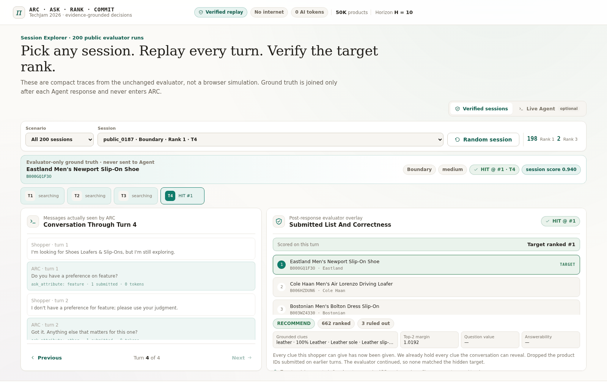
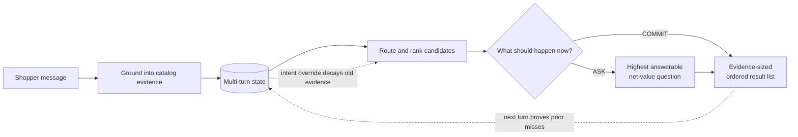

# 🛍️ ARC — Ask · Rank · Commit

### An answerability-aware, evidence-grounded sequential decision agent for conversational shopping

ARC is an offline multi-turn shopping agent built for TikTok TechJam 2026
Track 4.

One hidden product. A 50,000-item catalog. At most ten turns. The shopper starts
with incomplete requirements and may decline a question or change their mind.

ARC treats this as a **sequential decision problem**, not a one-shot
search query. On every turn it makes three connected decisions:

- 💬 **ASK** the question that is answerable and worth its extra turn;
- 📊 **RANK** products using accumulated shopper evidence, not popularity alone;
- 🎯 **COMMIT** only as many results as the current evidence can safely support.

| System                    |        Hit Rate@10 |                MRR |            MTTC |     TechnicalScore |
| ------------------------- | -----------------: | -----------------: | --------------: | -----------------: |
| Organizer weak baseline   |           0.125000 |           0.068034 |           9.810 |           0.106710 |
| ARC before this optimization | 1.000000 | 0.993333 | 2.040 | 0.977200 |
| **ARC** | **1.000000** | **1.000000** | **1.980** | **0.980400** |

These results use the unchanged organizer evaluator over all 200 public
sessions. ARC uses **zero model tokens, zero network calls, no GPU, and only the
Python standard library**. The measured optimization comparison is recorded in
[`results/optimization_results.json`](results/optimization_results.json).

## 🕹️ Try it live

**<https://kelvin715.github.io/techjam-2026-shopping-copilot/>**

The hosted replay and local Agent expose the same inspectable ARC decision
pipeline.

Ten pages in the browser. No install, no catalog download, no API key. Pages
1–3 give the problem, the turn loop, and the organizer result; pages 4–7 replay
all four turns of one session; page 8 is the evaluation evidence; page 9 is
what happens when the shopper stops quoting the catalog. Arrow keys
change pages, space plays, `F` is fullscreen. The green `VERIFIED REPLAY` badge
is earned: the page is published only when a SHA-256 manifest of every recorded
source still matches the repository.

### 🔎 Inspect any of the 200 sessions yourself

**[→ Open the session explorer](https://kelvin715.github.io/techjam-2026-shopping-copilot/?scene=9)**

[](https://kelvin715.github.io/techjam-2026-shopping-copilot/?scene=9&session=public_0187&turn=4)

<sub>Turn 4 of `public_0187`. Click the image to open that exact state.</sub>

Every public session was replayed through the submitted Agent and the unchanged
evaluator, and the last page lets you walk any of them:

- pick a **Scenario** — buying, browsing, intent override, boundary — or leave
  it on all 200;
- choose a **Session** id, or press **Random** to sample one;
- step the **Turn** selector: each step shows only the messages ARC had seen by
  that point, the list it submitted, and the decision certificate behind it —
  action, clues held, candidates ruled out, and the score margin;
- the target product and its rank sit in a panel labelled evaluator-only. It is
  joined *after* `Agent.respond` returns and is never sent to the Agent.

One click lands on a specific case:

- [`public_0187` at turn 3](https://kelvin715.github.io/techjam-2026-shopping-copilot/?scene=9&session=public_0187&turn=3) — the boundary case where the shopper declines a question and the policy pivots
- [only the intent-override sessions](https://kelvin715.github.io/techjam-2026-shopping-copilot/?scene=9&scenario=intent_override)
- [the four-turn walkthrough that explains the loop](https://kelvin715.github.io/techjam-2026-shopping-copilot/?scene=3)

The second tab, **Live Agent**, replaces the recording with the real thing: type
any shopper message and the submitted `Agent.respond` answers it, then *Explain
this decision* prints the certificate and the smallest clue removal that would
change rank one. It needs the 50,000-product catalog, which the data terms keep
out of this repository, so it runs locally only:

```bash
python3 demo/server.py --catalog data/catalog.jsonl --live --prewarm
```

## 🧭 Why shopping needs more than retrieval

A retrieval system can contain the right product and still create a poor
shopping experience:

1. A vague request may leave hundreds of equally plausible products.
2. A high-discrimination question may be useless if the shopper cannot answer it.
3. Showing ten weak candidates too early can end the session with the target at
   a poor rank.
4. Repeating products that were already rejected wastes both turns and trust.
5. A changed preference can make otherwise correct conversation memory stale.

The challenge metric makes these failures concrete. Hit Rate rewards finding
the target, MRR rewards putting it near the top, and MTTC charges for every
additional turn. ARC therefore optimizes the **interaction loop**,
not only a retrieval score.



## 🔁 The three decisions

### 💬 ASK — spend a turn only when it has value

For every allowed question, the agent treats plausible candidates as
counterfactual targets, predicts the answer exposed by each product's catalog
signature, and estimates the resulting rank utility:

```text
MVOI(question) = 0.50 × expected Hit@10
               + 0.30 × expected MRR
               - current rank utility
               - 0.02 × one additional turn
```

The `<none>` branch is handled honestly: “I have no preference” exhausts a
question but does not invent a new ranking constraint. The agent therefore asks
what is **answerable and likely to improve the scored outcome**, rather than
what merely partitions the candidate set most evenly.

### 📊 RANK — keep explicit evidence ahead of popularity

The agent first routes the conversation to a catalog shelf, then combines four
local signals:

```text
core(product) = normalized rare-term evidence
                + 0.30 × typed constraint satisfaction
                + 0.70 × canonical signature likelihood
```

The canonical four-slot signature distinguishes near-duplicate products whose
words occur in different fields or positions. Material, color, and budget are
checked as typed constraints. Review count and rating may break a near-tie, but
only when a candidate's core evidence is within `0.15` of the best candidate;
popularity cannot override a clear shopper requirement.

### 🎯 COMMIT — control output risk, not just relevance

With incomplete evidence, the agent returns one safe candidate while continuing
to clarify. Once all visible constraints are known, the shopper has exhausted
their preferences, or the conversation reaches the calibrated late-turn gate,
it expands to the full Top 10.

The protocol also provides grounded negative feedback: if the evaluator calls
the agent again, every product in the previous submitted list is a **proven
miss** for the active intent. Those products are excluded on the next turn.
When the shopper overrides their intent, this history is cleared atomically and
the old preference is retained only at reduced confidence.

## 🧩 Where a language model earns its place

The challenge permits LLMs but does not require one, and the scored path of
ARC does not use one: on the organizer's protocol the dominant uncertainty is
*which useful constraint has not been revealed yet*, not how to read the
sentence. Every top public-set score in this track, ours included, comes from
a deterministic system, and the two submissions we found that put a model
inside the scoring loop lost score to it.

That protocol, however, has the shopper **quote catalog strings inside fixed
templates**. Real shoppers do not. So ARC ships an optional **hybrid language
layer** that is off by default and byte-for-byte irrelevant to the official
score, but turns on for free-form wording:

```text
message ──► matches a protocol template? ──yes──► deterministic parser (0 tokens)
                     │
                     no ──► LLM proposes ──► catalog disposes ──► the same RANK · ASK · COMMIT
                            {intent, category,      every proposal needs evidence among the
                             material, color,        products still in play:
                             budget, features,        signature_verbatim 1.0 · signature_mapped 0.8
                             dropped}                 lexical 0.6 · lexical_tokens 0.5 · else refused
```

- **The model never ranks, never sees a label, and never sees the catalog.**
  It sees the shopper's sentence plus at most 40 of the most common catalog
  phrases in the candidate category, so it can say things in the catalog's own
  words before the catalog checks them.
- **Protocol wording never reaches the model.** On the 200 public sessions the
  hybrid mode makes zero calls and reports zero tokens; the score is identical.
- **A category becomes a union of shelves**, not a bet on one; once a full
  slate has been refuted the pool widens to the whole catalog (failure
  detection and strategy switching).
- **A cancelled preference is decayed to `0.5` confidence**, exactly as the
  deterministic override policy does, and the certificate records what was
  accepted, mapped, refused and why. A dead or slow endpoint degrades to the
  deterministic path with a contract-valid response.

Enable it with environment variables at construction time:

```bash
ARC_LLM_MODE=ground   ARC_LLM_BASE_URL=http://host:port/v1   ARC_LLM_MODEL=gemma4   # grounding only
ARC_LLM_MODE=assist   # grounding + the customer-facing message phrased from the certificate
```

### 🗣️ What happens when the shopper stops quoting the catalog

`tools/human_language_benchmark.py` keeps the organizer's simulator policy
byte-identical and rewrites only the *surface form* of every customer message
with a language model acting as a human shopper: **natural** keeps every
attribute phrase verbatim inside casual wording; **paraphrase** also says every
attribute in the shopper's own words and never quotes the listing. The same
rewrites are served to both arms from a cache.

| Shopper wording | Arm | Hit@10 | MRR | MTTC | TechnicalScore | Model calls | Tokens |
|---|---|---:|---:|---:|---:|---:|---:|
| Organizer templates (control) | deterministic (frozen submission) | 1.0000 | 1.0000 | 1.980 | 0.980400 | 0 | 0 |
| Organizer templates (control) | hybrid (LLM grounding) | 1.0000 | 1.0000 | 1.980 | 0.980400 | 0 | 0 |
| Natural wording, attributes verbatim | deterministic (frozen submission) | 0.8200 | 0.6252 | 4.495 | 0.727670 | 0 | 0 |
| Natural wording, attributes verbatim | hybrid (LLM grounding) | 0.9950 | 0.9530 | 2.390 | **0.955602** | 228 | 234,796 |
| Natural wording, attributes paraphrased | deterministic (frozen submission) | 0.2150 | 0.0681 | 10.005 | 0.147826 | 0 | 0 |
| Natural wording, attributes paraphrased | hybrid (LLM grounding) | 0.8200 | 0.7102 | 4.155 | **0.759952** | 794 | 765,795 |


- 200 public sessions; customer rewrites by `gemma4`, grounding by `gemma4` (the same local vLLM service; the rewriter sees only the template message, never the catalog).
- On the organizer templates the hybrid arm makes zero model calls and reproduces the deterministic score exactly: protocol wording never reaches the model.
- Natural wording, attributes verbatim: the hybrid arm averages 1.14 model calls and 1,174 tokens per session, 374 ms per call.
- Natural wording, attributes paraphrased: the hybrid arm averages 3.97 model calls and 3,829 tokens per session, 304 ms per call.
- Example rewrite: simulator “I'm looking for Jewelry Necklaces. A key requirement is: Material:alloy.” → shopper “I'm looking for some alloy necklaces.”.
- Agent latency with grounding on: natural wording mean 0.21 s per turn (p95 0.50 s); paraphrased wording mean 3.4 s (p95 16.4 s), because a grounded session that has refuted a full slate re-ranks the whole 50,000-product catalog on every later turn. Bounding that widening is the first optimisation on the list.
- Paraphrased wording by scenario (hybrid): buying 0.863 / browsing 0.875 / intent override 0.733 / boundary 0.300 Hit@10. The boundary drop is a simulator artefact: its shopper says "no preference" once and then answers that very attribute later, which a human reading treats as a retired question.
- Cross-model check: with `qwen2.5-7b-instruct` playing the shopper instead (rewrites precomputed by `tools/precompute_customer_rewrites.py`, grounding still `gemma4`), natural wording scores 0.4838 deterministic and 0.8684 hybrid (Hit@10 0.565 → 0.920, 2.5 calls per session); see `results/human_language_benchmark_natural_qwen_customer.json`.
- These are research diagnostics with a model playing the shopper, not organizer scores.


## 🗺️ How this maps to the Track 4 directions

The organizer's suggested techniques are possible tools, not a checklist. Our
design uses the parts that improve the shopping decision and leaves speculative
complexity disabled.

| Track direction                          | ARC implementation                                                         | Shopper-facing outcome                                                 |
| ---------------------------------------- | -------------------------------------------------------------------------- | ---------------------------------------------------------------------- |
| Buying vs. Browsing routing              | Scenario-aware shelf and question routing                                  | Decisive buyers are served immediately; vague browsers are clarified   |
| Hybrid retrieval and reranking           | Shelf retrieval plus lexical, typed, signature, and bounded-prior evidence | Exact constraints beat generic popularity                              |
| Structured state and intent override     | Confidence-weighted multi-turn memory with atomic history reset            | Preferences accumulate without trapping the shopper in an old intent   |
| Adaptive clarification                   | Answerability-aware metric value of information                            | The agent avoids questions that cost a turn but add no usable evidence |
| Failure detection and strategy switching | Proven-miss exclusion, refusal-aware pivot, late exact-tie rotation        | Rejected products are not repeated and long-tail ties can recover      |
| Cold-start ranking                       | Review-count prior only before the first shopper constraint                | A vague first turn is useful without letting popularity override intent |
| Indistinguishable-candidate planning      | Finite-horizon batch-size optimization with final-turn Hit@10 insurance     | Exact intent twins are tested at rank one instead of committed at a weak rank |
| Low latency and token cost               | Deterministic, offline, standard-library runtime                           | No API outage, credential, GPU, or per-query model cost                |
| Transparent explanations                 | Evidence certificates and verified minimal counterfactuals                 | Engineers can inspect why the action and rank changed                  |
| LLM semantic understanding               | Optional catalog-verified grounding layer for free-form wording (off on the scored path) | Shoppers can speak naturally; the model cannot invent evidence |
| Safe personalization                     | Aggregate profile support exists, but its ranking weight is disabled       | Unproven profile correlations cannot override explicit intent          |

Dense semantic retrieval and profile weighting remain optional extensions. They
were not enabled simply to match a suggested architecture; a new component must
earn its complexity across public, popularity-matched, and uniform long-tail
diagnostics.

## 📈 Evaluation

### 🏁 Official public set

| Scenario          |             n |        Hit Rate@10 |                MRR |               MTTC |
| ----------------- | ------------: | -----------------: | -----------------: | -----------------: |
| Buying            |            80 |           1.000000 |           1.000000 |           1.487500 |
| Browsing          |            80 |           1.000000 |           1.000000 |           1.775000 |
| Intent override   |            30 |           1.000000 |           1.000000 |           3.666667 |
| Boundary          |            10 |           1.000000 |           1.000000 |           2.500000 |
| **Overall** | **200** | **1.000000** | **1.000000** | **1.980000** |

The unchanged evaluator reports ARC's final TechnicalScore of `0.980400`.

The organizer weak baseline needs `9.81` turns on average; ARC needs `1.980`, a
reduction of `7.830` evaluator turns while raising MRR from `0.068034` to `1.0`.

With Hit Rate@10 and MRR both saturated at `1.0`, TechnicalScore is a pure
function of MTTC, and a rank-1 result demoted to rank 2 costs as much as `7.5`
saved turns. `tools/turn_audit.py` replays the organizer loop while capturing
the full ranked list each turn and reports that **zero** turns are lost to the
output gate: the target is exposed on exactly the turn it first reaches rank 1.
The residual MTTC is therefore bounded by disclosure, not by the policy —
`intent_override` cannot score before its override turn (floor `3.600`),
`boundary` spends one turn on the "no preference" reply, and 90 of 200 sessions
open with no constraint at all.

### 🔬 Target-disjoint diagnostics

| Diagnostic         |     n | Hit Rate@10 |      MRR |    MTTC | TechnicalScore |
| ------------------ | ----: | ----------: | -------: | ------: | -------------: |
| Popularity-matched |   800 |    1.000000 | 0.984496 | 2.12125 |       0.972924 |
| Uniform long-tail  | 1,000 |    0.996000 | 0.977408 | 2.61900 |       0.958842 |

These are deterministic synthetic sessions over non-public catalog targets.
They test whether the design survives outside the 200 public labels; they are
not organizer-private scores or claims about the private distribution.

### 🛡️ Language and policy robustness

| Robustness condition | Hit@10 |    MRR | TechnicalScore |
| -------------------- | -----: | -----: | -------------: |
| Natural paraphrase   |  1.000 | 1.0000 |       0.980600 |
| One hidden clue      |  1.000 | 0.9079 |       0.951775 |

Across 100 public targets, all audited traces stay within ten turns, return
valid unique catalog ASINs, do not repeat proven misses before an override,
report zero tokens, and leave the catalog byte-identical.

### ⚡ Runtime disclosure

| Resource                               | Measurement |
| -------------------------------------- | ----------: |
| Agent startup/index build              |     11.65 s |
| Mean evaluator wall time per response  |    38.74 ms |
| Evaluation wall time after startup     |     15.34 s |
| Peak evaluator + agent resident memory |  465,644 KB |
| Prompt / completion tokens             |       0 / 0 |
| External API calls                     |           0 |
| Estimated inference cost               |       $0.00 |
| Network / GPU required for scoring     |     No / No |

Timing varies with CPU and filesystem cache. The development evaluator retains
a second catalog representation; a production integration could share immutable
storage.

## 🏗️ Architecture and source map

| Runtime responsibility                         | Source                                  |
| ---------------------------------------------- | --------------------------------------- |
| Official`Agent.reset/respond` interface      | [`agent.py`](agent.py)                 |
| Shelf, catalog, signature, and support indexes | [`src/shelf.py`](src/shelf.py)         |
| Intent parsing and multi-turn state            | [`src/dialog.py`](src/dialog.py)       |
| Hybrid evidence ranking and bounded prior      | [`src/rank.py`](src/rank.py)           |
| Clarification and patient output policy        | [`src/policy.py`](src/policy.py)       |
| MVOI and decision certificates                 | [`src/evidence.py`](src/evidence.py)   |
| Frozen measured configuration                  | [`src/config.py`](src/config.py)       |
| Evaluator compatibility shim                   | [`starter/agent.py`](starter/agent.py) |

At startup, the agent constructs read-only shelf, document-frequency,
normalized-text, typed-attribute, canonical-signature, rating, and rating-count
indexes. At runtime, each session stores the shelf, scenario, normalized unique
constraints, confidence, clue-order reliability, exhausted questions, and
recommendation history. No catalog row is modified or mocked.

The root entry point implements the organizer contract directly:

```python
class Agent:
    def reset(self, session_id: str, user_profile: dict) -> None: ...

    def respond(
        self, session_id: str, user_message: str, turn: int, top_k: int
    ) -> dict: ...
```

## 🔧 Setup and reproduction

Requirements:

- Python 3.10 or newer;
- about 500 MB free RAM for the agent, or about 850 MB when the evaluator and
  agent both retain catalog representations;
- no GPU, API key, credential, vector database, or network at inference time.

There are no third-party runtime dependencies, including for the optional
language layer: `src/llm.py` speaks the OpenAI chat-completions protocol --
tool calls included -- over `urllib`, so any compatible endpoint is reachable
by environment variable alone. A hosted model needs no package:

```bash
export ARC_LLM_MODE=ground ARC_LLM_BASE_URL=https://api.openai.com/v1
export ARC_LLM_MODEL=gpt-4o-mini ARC_LLM_API_KEY=sk-...
```

The layer stays off in the scored run (`LLM_MODE = "off"`), which is
deterministic and token-free. `LLM_GROUND_VERIFY` (or `ARC_LLM_VERIFY`)
chooses how it reads a message when it is on: `propose` asks once and
verifies afterwards, `iterative` lets the model check a phrase through
`_verify_feature` before committing to it.

```bash
python3 -m pip install -r requirements.txt
```

Download `catalog.jsonl.gz` from the official
[participant-kit release](https://github.com/TechJam2026/techjam-conversational-search/releases/tag/participant-kit),
then verify and extract it:

```bash
sha256sum -c SHA256SUMS
gzip -dc catalog.jsonl.gz > data/catalog.jsonl
wc -l data/catalog.jsonl  # expected: 50000
```

Run contract checks and the full test suite (72 dependency-free tests):

```bash
python3 tools/preflight.py
python3 -m unittest discover -s tests -v
```

Run the unchanged public evaluator:

```bash
python3 -m evaluator.local_evaluator \
  --catalog data/catalog.jsonl \
  --dataset data/public_set.jsonl \
  --output results/public_full.json
```

Expected result:

```text
Hit Rate@10  1.000000
MRR          1.000000
MTTC         1.980000
Efficiency   0.902000
Score        0.980400
```

Reproduce the non-public-target and robustness diagnostics:

```bash
python3 tools/matched_proxy.py
python3 tools/uniform_proxy.py
python3 tools/robustness_policy_benchmark.py --count 100
python3 tools/turn_audit.py    # where every evaluator turn is spent
```

Machine-readable results are under [`results/`](results/). Each tool in
[`tools/`](tools/) prints its own usage and writes the summary it documents, so
the MVOI, output-risk calibration, and long-tail diagnostics can be re-run
directly.

## ⚠️ Limitations

The conversations are simulated from product metadata. Private-set behavior
and real conversion or GMV impact remain unknown until controlled evaluation.

## 📋 Tools, data, and contribution disclosure

- **Runtime:** Python 3.10 standard library only; no API, framework, hosted
  model, vector database, or model token use.
- **Development:** Python, Git, command-line profiling, and Codex for
  repository navigation, test generation, and experiment orchestration.
- **Data:** frozen 50,000-product competition catalog and 200 public sessions
  derived from Amazon Reviews 2023 `Clothing_Shoes_and_Jewelry`; see
  [`DATA_ATTRIBUTION.md`](DATA_ATTRIBUTION.md).
- **Contribution:** see [Team and contributions](#team-and-contributions).

## 👥 Team and contributions

| Member                 | Contact               | Contribution                                                                                                                                                                                                           |
| ---------------------- | --------------------- | ---------------------------------------------------------------------------------------------------------------------------------------------------------------------------------------------------------------------- |
| **Zhihan Yang**  | zhihan.yang@u.nus.edu | Idea and implementation. Problem framing as a sequential decision loop, the ASK · RANK · COMMIT policy design, all submitted runtime code, the offline experiment and diagnostic tooling, and the judge-facing demo. |
| **Li Haixin**    | e1113229@u.nus.edu    | Evaluation and quality assurance. Test-suite and contract review, preflight checks, robustness and stress-case triage, and reproduction of the reported numbers from a clean checkout.                                 |
| **Dong Yicheng** | DONG0195@e.ntu.edu.sg | Demo video. Storyboard, recording, and editing of the walkthrough, and timing the narration against the presentation pages.                                                                                            |
| **Minxi Chen**   | chen1997@e.ntu.edu.sg | Documentation and submission materials. README and Devpost description review, judge Q&A, the business-impact one-pager, and the final submission checklist.                                                           |
| **Qian Nuowen**  | qian_nuowen@u.nus.edu | Research support. Prior-art survey on conversational recommendation, value-of-information questioning, and counterfactual explanation; baseline comparison notes; review of the diagnostic design.                     |
