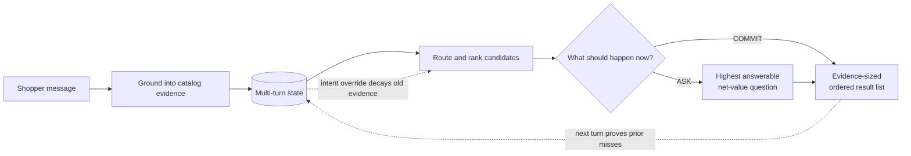

# ARC — Ask · Rank · Commit

### An answerability-aware, evidence-grounded sequential decision agent for conversational shopping

ARC is an offline multi-turn shopping agent built for TikTok TechJam 2026
Track 4.

One hidden product. A 50,000-item catalog. At most ten turns. The shopper starts
with incomplete requirements and may decline a question or change their mind.

ARC treats this as a **sequential decision problem**, not a one-shot
search query. On every turn it makes three connected decisions:

- **ASK** the question that is answerable and worth its extra turn;
- **RANK** products using accumulated shopper evidence, not popularity alone;
- **COMMIT** only as many results as the current evidence can safely support.

| System | Hit Rate@10 | MRR | MTTC | TechnicalScore |
|---|---:|---:|---:|---:|
| Organizer weak baseline | 0.125000 | 0.068034 | 9.810 | 0.106710 |
| **ARC (submitted)** | **1.000000** | **0.993333** | **2.040** | **0.977200** |

These results use the unchanged organizer evaluator over all 200 public
sessions. The submitted runtime uses **zero model tokens, zero network calls,
no GPU, and only the Python standard library**.

## Why shopping needs more than retrieval

A retrieval system can contain the right product and still create a poor
shopping experience:

1. A vague request may leave hundreds of equally plausible products.
2. A high-discrimination question may be useless if the shopper cannot answer it.
3. Showing ten weak candidates too early can end the session with the target at
   a poor rank.
4. Repeating products that were already rejected wastes both turns and trust.
5. A changed preference can make otherwise correct conversation memory stale.

The challenge metric makes these failures concrete. Hit Rate rewards finding
the target, MRR rewards putting it near the top, and MTTC charges for every
additional turn. ARC therefore optimizes the **interaction loop**,
not only a retrieval score.



## The three decisions

### ASK — spend a turn only when it has value

For every allowed question, the agent treats plausible candidates as
counterfactual targets, predicts the answer exposed by each product's catalog
signature, and estimates the resulting rank utility:

```text
MVOI(question) = 0.50 × expected Hit@10
               + 0.30 × expected MRR
               - current rank utility
               - 0.02 × one additional turn
```

The `<none>` branch is handled honestly: “I have no preference” exhausts a
question but does not invent a new ranking constraint. The agent therefore asks
what is **answerable and likely to improve the scored outcome**, rather than
what merely partitions the candidate set most evenly.

### RANK — keep explicit evidence ahead of popularity

The agent first routes the conversation to a catalog shelf, then combines four
local signals:

```text
core(product) = normalized rare-term evidence
                + 0.30 × typed constraint satisfaction
                + 0.70 × canonical signature likelihood
```

The canonical four-slot signature distinguishes near-duplicate products whose
words occur in different fields or positions. Material, color, and budget are
checked as typed constraints. Review count and rating may break a near-tie, but
only when a candidate's core evidence is within `0.15` of the best candidate;
popularity cannot override a clear shopper requirement.

### COMMIT — control output risk, not just relevance

With incomplete evidence, the agent returns one safe candidate while continuing
to clarify. Once all visible constraints are known, the shopper has exhausted
their preferences, or the conversation reaches the calibrated late-turn gate,
it expands to the full Top 10.

The protocol also provides grounded negative feedback: if the evaluator calls
the agent again, every product in the previous submitted list is a **proven
miss** for the active intent. Those products are excluded on the next turn.
When the shopper overrides their intent, this history is cleared atomically and
the old preference is retained only at reduced confidence.

## Why we deliberately did not put an LLM in the runtime

The challenge permits LLMs, but it does not require one. We chose the smallest
system that directly addresses the measured bottleneck.

In this benchmark, shopper messages reveal catalog-derived constraints and a
hit is an exact ASIN match. The dominant uncertainty is which useful constraint
has not yet been revealed—not how to generate fluent prose.

| What this task requires | Why an LLM is not the default solution here |
|---|---|
| Exact catalog-valid ASIN ranking | Fluent text does not guarantee exact identifier retrieval or ordering |
| Persistent constraints and overrides | These need explicit, testable state transitions rather than implicit prompt memory |
| Metric-aware question and output policy | An LLM does not automatically optimize Hit@10, MRR, and turn cost |
| Reproducible official scoring | Hosted inference adds network, credential, latency, cost, and nondeterminism risks |
| Grounded explanations | Generated rationale may sound plausible without matching the actual reranker |

The intelligence is concentrated in deciding what evidence to acquire, how to
update it, and when it is sufficient—not in generating more fluent prose.

This is not a claim that language models are never useful. It is an architectural
boundary: use deterministic catalog evidence for the common path, and introduce
a small local language or embedding fallback only when an ambiguous Top-N case
shows a measured gain. Today the grounded parser already preserves canonical
performance, raises natural-paraphrase Hit@10 from `0.88` to `1.00`, and raises
pass-all-variants from `0.88` to `1.00`. This is not an anti-LLM position: we
would add a model when it earns its latency and complexity with a measured gain
on unresolved language cases. Until then, putting one on the critical path
would add operational risk without addressing the dominant failure mode.

## How this maps to the Track 4 directions

The organizer's suggested techniques are possible tools, not a checklist. Our
design uses the parts that improve the shopping decision and leaves speculative
complexity disabled.

| Track direction | ARC implementation | Shopper-facing outcome |
|---|---|---|
| Buying vs. Browsing routing | Scenario-aware shelf and question routing | Decisive buyers are served immediately; vague browsers are clarified |
| Hybrid retrieval and reranking | Shelf retrieval plus lexical, typed, signature, and bounded-prior evidence | Exact constraints beat generic popularity |
| Structured state and intent override | Confidence-weighted multi-turn memory with atomic history reset | Preferences accumulate without trapping the shopper in an old intent |
| Adaptive clarification | Answerability-aware metric value of information | The agent avoids questions that cost a turn but add no usable evidence |
| Failure detection and strategy switching | Proven-miss exclusion, refusal-aware pivot, late exact-tie rotation | Rejected products are not repeated and long-tail ties can recover |
| Low latency and token cost | Deterministic, offline, standard-library runtime | No API outage, credential, GPU, or per-query model cost |
| Transparent explanations | Evidence certificates and verified minimal counterfactuals | Engineers can inspect why the action and rank changed |
| Safe personalization | Aggregate profile support exists, but its ranking weight is disabled | Unproven profile correlations cannot override explicit intent |

Dense semantic retrieval and profile weighting remain optional extensions. They
were not enabled simply to match a suggested architecture; a new component must
earn its complexity across public, popularity-matched, and uniform long-tail
diagnostics.

## The demo story: four turns, one decision loop

The three-minute demo does not introduce a separate showcase algorithm. It
replays the same submitted `Agent` and makes the three decisions visible on one
public Boundary session that begins in browsing mode:

| Turn | Shopper evidence | Agent decision | What changes |
|---:|---|---|---|
| 1 | Browsing for loafers; no constraint yet | **ASK** for the highest-value feature and expose one safe ID | The 50,000-item catalog narrows to a 665-product shelf |
| 2 | No preference for that feature | **PIVOT** without creating a fake constraint | The previous ID becomes a proven miss; the agent asks openly |
| 3 | Leather | **RANK**, but keep the patient gate closed | The target moves from rank 93 to rank 10; 211 candidates remain close |
| 4 | Leather sole, dual gore panels, padded collar | **COMMIT** the full Top 10 | The complete evidence moves the target to rank 1 |

Target rank is displayed only as an evaluator-side diagnostic. The target ASIN
is never passed to the Agent.

Run the verified replay:

```bash
python3 demo/server.py
```

Open <http://127.0.0.1:8765>. The first eight pages are the recorded
presentation. Page 9 is a static-first **Session Explorer**: select any of the
200 public evaluator runs, move through its turns, inspect the submitted ranking,
and see exactly when and where the hidden target was found. Ground truth is
joined only after each Agent response and appears in a visibly evaluator-only
panel. Neither the catalog nor a server-side Agent is needed to explore those
verified traces online.

`VERIFIED REPLAY` is shown only when the recorded source manifest matches the
working tree. Frontend, HTTP, Session Explorer, optional live mode, evidence,
evaluator, and Agent behavior are covered by the verified test suite.

For the optional real-Agent sandbox:

```bash
python3 demo/server.py --catalog data/catalog.jsonl --live --prewarm
```

This enables the optional **Live Agent** tab on Page 9 without changing the
verified sessions. A static host such as GitHub Pages cannot run the Python
Agent; it serves the complete Session Explorer and explains how to start live
mode locally.

See [`demo/README.md`](demo/README.md) for recording, live-mode, and static
deployment instructions.

## Evaluation

### Official public set

| Scenario | n | Hit Rate@10 | MRR | MTTC |
|---|---:|---:|---:|---:|
| Buying | 80 | 1.000000 | 1.000000 | 1.487500 |
| Browsing | 80 | 1.000000 | 0.991667 | 1.912500 |
| Intent override | 30 | 1.000000 | 0.977778 | 3.633333 |
| Boundary | 10 | 1.000000 | 1.000000 | 2.700000 |
| **Overall** | **200** | **1.000000** | **0.993333** | **2.040000** |

The organizer weak baseline needs `9.81` turns on average; ARC needs
`2.04`, a reduction of `7.77` evaluator turns while raising MRR from `0.068034`
to `0.993333`.

### Target-disjoint diagnostics

| Diagnostic | n | Hit Rate@10 | MRR | MTTC | TechnicalScore |
|---|---:|---:|---:|---:|---:|
| Popularity-matched | 800 | 1.000000 | 0.972265 | 2.15250 | 0.968630 |
| Uniform long-tail | 1,000 | 0.996000 | 0.946613 | 2.52900 | 0.951404 |

These are deterministic synthetic sessions over non-public catalog targets.
They test whether the design survives outside the 200 public labels; they are
not organizer-private scores or claims about the private distribution.

### Language and policy robustness

| Parser / reveal | Hit@10 | MRR | TechnicalScore |
|---|---:|---:|---:|
| Canonical parser / natural paraphrase | 0.880 | 0.5141 | 0.728018 |
| **Grounded parser / natural paraphrase** | **1.000** | **0.9933** | **0.977600** |
| Grounded parser / one hidden clue | 1.000 | 0.8895 | 0.945658 |

Across 100 public targets, the grounded parser recovers 12 sessions and reduces
average Agent calls from `4.19` to `2.02`. All audited traces stay within ten
turns, return valid unique catalog ASINs, do not repeat proven misses before an
override, report zero tokens, and leave the catalog byte-identical.

### Runtime disclosure

| Resource | Measurement |
|---|---:|
| Agent startup/index build | 10.77 s |
| Mean evaluator wall time per response | 42.36 ms |
| Evaluation wall time after startup | 17.28 s |
| Peak evaluator + agent resident memory | 466,444 KB |
| Prompt / completion tokens | 0 / 0 |
| External API calls | 0 |
| Estimated inference cost | $0.00 |
| Network / GPU required for scoring | No / No |

Timing varies with CPU and filesystem cache. The development evaluator retains
a second catalog representation; a production integration could share immutable
storage.

## Why the evidence is inspectable

- The runtime sees only the frozen catalog, aggregate profile, user message,
  turn number, and `top_k`; it never receives the target ASIN.
- The catalog is read-only and every returned identifier is validated against it.
- Every turn produces a separate evidence certificate with action reason,
  grounded constraints, candidate counts, score margin, excluded proven misses,
  question value, and named product evidence.
- `Agent.explain_last_decision()` searches for the smallest observed constraint
  set whose removal actually changes rank one. It reports invariant cases
  instead of inventing an explanation.
- The output gate was selected from six candidate policies on a target-disjoint
  split rather than chosen by hand; `python3 tools/risk_gate_calibration.py`
  reproduces that selection and its held-out risk bound.

Every A/B, calibration, and robustness run above is reproducible from the
commands in [Setup and reproduction](#setup-and-reproduction); the machine-
readable summaries live under [`results/`](results/).

## Architecture and source map

| Runtime responsibility | Source |
|---|---|
| Official `Agent.reset/respond` interface | [`agent.py`](agent.py) |
| Shelf, catalog, signature, and support indexes | [`src/shelf.py`](src/shelf.py) |
| Intent parsing and multi-turn state | [`src/dialog.py`](src/dialog.py) |
| Hybrid evidence ranking and bounded prior | [`src/rank.py`](src/rank.py) |
| Clarification and patient output policy | [`src/policy.py`](src/policy.py) |
| MVOI and decision certificates | [`src/evidence.py`](src/evidence.py) |
| Frozen measured configuration | [`src/config.py`](src/config.py) |
| Evaluator compatibility shim | [`starter/agent.py`](starter/agent.py) |

At startup, the agent constructs read-only shelf, document-frequency,
normalized-text, typed-attribute, canonical-signature, rating, and rating-count
indexes. At runtime, each session stores the shelf, scenario, normalized unique
constraints, confidence, clue-order reliability, exhausted questions, and
recommendation history. No catalog row is modified or mocked.

The root entry point implements the organizer contract directly:

```python
class Agent:
    def reset(self, session_id: str, user_profile: dict) -> None: ...

    def respond(
        self, session_id: str, user_message: str, turn: int, top_k: int
    ) -> dict: ...
```

## Setup and reproduction

Requirements:

- Python 3.10 or newer;
- about 500 MB free RAM for the agent, or about 850 MB when the evaluator and
  agent both retain catalog representations;
- no GPU, API key, credential, vector database, or network at inference time.

There are no third-party runtime dependencies:

```bash
python3 -m pip install -r requirements.txt
```

Download `catalog.jsonl.gz` from the official
[participant-kit release](https://github.com/TechJam2026/techjam-conversational-search/releases/tag/participant-kit),
then verify and extract it:

```bash
sha256sum -c SHA256SUMS
gzip -dc catalog.jsonl.gz > data/catalog.jsonl
wc -l data/catalog.jsonl  # expected: 50000
```

Run contract checks and all 47 dependency-free tests:

```bash
python3 tools/preflight.py
python3 -m unittest discover -s tests -v
```

Run the unchanged public evaluator:

```bash
python3 -m evaluator.local_evaluator \
  --catalog data/catalog.jsonl \
  --dataset data/public_set.jsonl \
  --output results/public_full.json
```

Expected result:

```text
Hit Rate@10  1.000000
MRR          0.993333
MTTC         2.040000
Efficiency   0.896000
Score        0.977200
```

Reproduce the non-public-target and robustness diagnostics:

```bash
python3 tools/matched_proxy.py
python3 tools/uniform_proxy.py
python3 tools/robustness_policy_benchmark.py --count 100
```

Machine-readable results are under [`results/`](results/). Each tool in
[`tools/`](tools/) prints its own usage and writes the summary it documents, so
the MVOI, output-risk calibration, ablation, and long-tail experiments can be
re-run directly.

## Limitations and next steps

1. The grounded parser covers the measured natural paraphrases, but spelling
   errors, compound negation, multilingual input, and ambiguous references need
   stronger semantics.
2. A hidden clue preserves Hit@10 in the current stress test but lowers MRR.
3. Uniform long-tail score (`0.951404`) remains below the popularity-matched
   diagnostic (`0.968630`). Identical visible intent cards cannot uniquely
   identify every graphic or style variant.
4. Aggregate profile tags are supported but carry zero ranking weight because
   they did not show a robust multi-distribution gain.
5. A small local embedding model or language reranker is a candidate fallback
   only for ambiguous Top-N cases; it must justify its cold-start, memory,
   latency, and reproducibility costs with measured improvement.
6. The conversations are simulated from product metadata. Private-set behavior
   and real conversion or GMV impact remain unknown until controlled evaluation.

## Tools, data, and contribution disclosure

- **Runtime:** Python 3.10 standard library only; no API, framework, hosted
  model, vector database, or model token use.
- **Development:** Python, Git, command-line profiling, and OpenAI Codex for
  repository navigation, test generation, and experiment orchestration. Codex
  is not part of the submitted runtime.
- **Data:** frozen 50,000-product competition catalog and 200 public sessions
  derived from Amazon Reviews 2023 `Clothing_Shoes_and_Jewelry`; see
  [`DATA_ATTRIBUTION.md`](DATA_ATTRIBUTION.md).
- **Contribution:** see [Team and contributions](#team-and-contributions).

## Team and contributions

| Member | Contact | Contribution |
|---|---|---|
| **Zhihan Yang** | zhihan.yang@u.nus.edu | Idea and implementation. Problem framing as a sequential decision loop, the ASK · RANK · COMMIT policy design, all submitted runtime code in `agent.py` and `src/`, the offline experiment and diagnostic tooling, and the judge-facing demo. |
| **Li Haixin** | e1113229@u.nus.edu | Evaluation and quality assurance. Test-suite and contract review, preflight checks, robustness and stress-case triage, and reproduction of the reported numbers from a clean checkout. |
| **Dong Yicheng** | DONG0195@e.ntu.edu.sg | Demo video. Storyboard, recording, and editing of the walkthrough, and timing the narration against the presentation pages. |
| **Minxi Chen** | chen1997@e.ntu.edu.sg | Documentation and submission materials. README and Devpost description review, judge Q&A, the business-impact one-pager, and the final submission checklist. |
| **Qian Nuowen** | qian_nuowen@u.nus.edu | Research support. Prior-art survey on conversational recommendation, value-of-information questioning, and counterfactual explanation; baseline comparison notes; review of the diagnostic design. |
